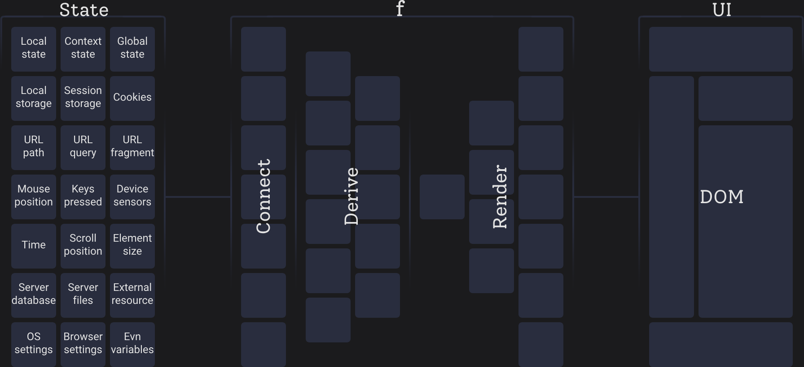

# Conceptual Model of React and RSC

Building web apps is a complex problem. We need simple high-level mental structures to support such a heavy load.
These structures allow us to offload unnecessary details from our brains, so we can focus on the important parts of our code.
`UI = f(state)` is one of them. Every one of us knows this formula. But do you know what it reflects in the real world?
What is `UI`? What is `state`? What the f* is *`f`*? And how is it affected by RSC (React Server Components)? Here is my view.

{/* truncate */}



Initial clarifications:
- I reckon the state mutates, but I ignore how it is mutated.
- I show examples of React, but most of the following applies to other UI frameworks like Angular, Vue, Svelte, Qwik, or Solid.


## What is `state`?

Let's reconsider: `UI = f(state)`. In other words, `state` is what our `UI` depends on. If a dependency changes, we want to change the `UI`. This phenomenon is called **reactivity**.

I believe that state encompasses more than just in-memory local component state (`useState`) or in-memory global app state (Redux, Jotai, Zustand).
I'm not alone (
[TkDodo](https://tkdodo.eu/blog/react-query-as-a-state-manager),
[ByteGrad (YouTube)](https://www.youtube.com/watch?v=ukpgxEemXsk),
[Kent C. Dodds](https://x.com/kentcdodds/status/1349173470567964673),
[Dave Rupert](https://daverupert.com/2024/02/ui-states/),
[Dan Abramov](https://overreacted.io/the-two-reacts/)
). Many developers agree that at least the URL and server data constitute some kind of state too. But I believe it has a much wider scope.

Let's consider some `UI` examples:

- Blog post UI depends on the slug present in the **URL** address.
- Server files explorer UI depends on **server** files.
- The newest movies list UI relies on the **third-party** resource of OMDB. 
- Ticking clock UI depends on **time**.
- Drawing canvas UI relies on the mouse position of the user's **input device**.
- User profile UI depends on the session token stored in a **cookie**.
- The "Keep me signed in on this device" UI depends on a flag in **local storage**.
- OS preferred dark mode UI depends on the **OS setting**.
- Devtools debug UI depends on an **env variable**.
- Panoramic background UI depends on the scroll position of a **DOM** element.
- ... Got the idea?

I refer to these states as **source states**. It's important to note that a state may be *derived*. For example:

- The current post *slug* depends on the **URL**.
- The current post *minutes read* depends on the *slug* and **server files**.
- The current *user role* depends on authorization data in the **server database** and the session token from the **cookie**.
- The *preferred dark mode* depends on **local storage** and the **OS setting** (storage as user preference and OS as default).
- The minutes value in a pausable stopwatch depends on **time** and the spacebar **pressed key**.
- ... Ok. You got it.

Derived state depends on another state and should change when its dependencies change. In other words, it should be reactive. You can find a great deep-dive into this topic on [React Training - Derived State](https://reacttraining.com/blog/derived-state).

The boundary between **source** and *derived* states is blurry. For example, the server database, local storage, OS settings, all of those depend on file system data.
But let's mark state as "source" when it depends solely on states inaccessible by available technologies. For example, I can't access some private browser file with local storage data from the browser window environment.

I would like to be explicit and distinguish between in-memory state and all those kinds of states.
For myself, I name it a **Holistic state**.


## What is `UI`?

It is what users perceive with their senses, usually with their eyes on the screen. On the web, it is represented with the **DOM**.

The wilderness out there is more diverse.
Our user might be a machine like a search indexing bot, but they also work on DOM elements and attributes.
There could be assistive technologies like a screen reader, working on the DOM as well.
A very important piece of UI is the URL in the browser address bar. Since it is always in sync with the URL state, I like to think about it as a source state rather than UI. 
Users also perceive playing sounds, haptic vibration feedback, flashlight, etc.
Let's simplify and stick with DOM only. It's worth mentioning that the following applies to other UI pieces similarly.

As a developer, I expect the framework to provide tools to describe UI and update the DOM when the description changes.
In React and Vue, those tools are JSX and VDOM. In Solid, it is a signal dependency graph.

Note: I classified DOM as both UI and source state. If we use DOM as a source state and let our UI depend on it, we create a cyclic dependency.
Sometimes it is necessary, e.g., when measuring text width. Be careful in such situations to not create infinite loops. The same applies to the URL.


## What the f* is *`f`*?

*`f`* is something that connects `state` and `UI`.
You may say it is the component tree with its render function. And you are <abbr title="In My Opinion">IMO</abbr> partially right. 

Because this *`f`* function usually produces many UI pieces,
it is a "necessity" to split the mental load into reusable smaller `f`s - components.
[Dan Abramov](https://overreacted.io/a-chain-reaction/) wrote a great article about it.

React component ergonomics example:
```tsx
function Post(slug) {                  // name and state received via props
    const posts = useQuery(fetchPosts) // state received via hook
    const post = posts[slug]           // derivation logic
    return <div>{post}</div>           // JSX UI description
}
```

- **Name** of the function to be referenceable.
- **Receive state** via props or hooks (or higher-order components).
- **Derive state** before JSX is produced. Right within the render function or separated into a custom function.
- **Produce UI description** in the form of JSX which is then consumed by VDOM.

I said partially. Components do not (usually) directly connect to states. They just receive a value/connection.


## Connecting States

We need a way to choose the states upon which our component depends. We want to subscribe/observe changes and execute derivation and rendering logic with new values.

Hooks do an excellent job with their smart `useEffect` and `useRef`. Much maligned for their ergonomics, but in my opinion, they get the conceptual job right. Let's refer to custom hooks using `useEffect` and `useRef` as **connecting hooks**.

React connecting hook ergonomics example:
```tsx
// name and config received via props
fucntion useStopwatch(delay) {          
    const [ticks, setTicks] = useState(0)
    useEffect(() => {         
        // subscribing to real world state (time)            
        const timer = setInterval(() => setTicks(prev => prev + 1), delay)
        return () => clearInterval(timer)
    }, [delay])
    // Returning reactive state
    return ticks                          
}
```

Many libraries like `tanstack-query` for external resources, `react-router` for URLs, or `react-use` for various kinds of states have been created. They allow us (app devs) to connect to the source state with just one line of code from within the component. And don't care much about how. Great abstraction.

These connecting hooks are the missing glue between state and component rendering logic. They subscribe to state changes and rerun the necessary derivation and rendering logic accordingly.

In my opinion, the observer pattern is best for developer experience (DX). But sometimes it is not possible or desired, usually for performance reasons. Typically, this is the case for states far away from the client, like server data. Even for them, we have mechanisms like websockets or long polling. But usually, we fall back to the initial fetch during either component mount, server request, or build. Then caching, invalidation, and optimistic update mechanisms must come into play. But let's still call them connecting hooks anyway.

There are hooks that create state themselves, like `useState` and `useReducer`, and simultaneously connect to it. But let's stick with the word "connecting" only.


## Developer Experience

So the real-world picture of `UI = f(state)` for app developers could be condensed into:
```js
DOM = render(derive(connect(holistic_state)))
```

It is a super simple mental model for such a complex problem as a web app. It is **conceptually clean and mentally relieving**. Modern client-side <abbr title="Single Page Application">SPA</abbr>s follow this conceptual model quite precisely. I believe many devs love React 16.8+ (hooks introduced) because of this mental model, myself included. It speeds up development, saves time, and money.

But for the model to be helpful, some additional properties must be met:

1. **Composable** - Ability to compose components into the full UI.<br/>
   Ability to <mark>place any component into any other component</mark>.

2. **Reusable** - Ability to define a name and reuse a component in a different place.<br/>
   Also, the ability to pass arbitrary configuration (possibly reactive state) to adjust its behavior (props).

3. **Colocated** - Name, render logic, necessary state connections, state derivation logic, documentation, etc.<br/>
   Devs should be able to <mark>place all those dependencies inside a component</mark>.<br/>
   If not, devs jump back and forth in a codebase. Inconvenient.

4. **Encapsulated** - Ability to work on a component independently by default. Opt-in to break the barrier.<br/>
   If not met, devs must mentally think about other code pieces.
   Note: this is broken by React cascading memoization. Frustrating.

5. **Reactive** - Component must react to connected state the dev chooses.<br/>
   <mark>Any component must be able to connect to any state</mark>. The same applies for derivation hooks.<br/>
   If some rules are required, it makes development jammed.

6. **Arbitrary** - The component's boundaries must obey the dev's needs.<br/>
   <mark>Nothing must force a component to split (or not to split)</mark>.<br/>
   Same for derivation hooks. It destroys their purpose otherwise.

Why does all of this matter? Because the conceptual model needs to be solid. All the time. If we develop some complex logic with those principles in mind, it can't happen due to broken principles that we need to refactor. I want to trust it will support me during heavy loads.

I can handle some configuration and syntax overhead like useEffect, CSS integration, or Webpack. I'm fine to write a few extra chars if the conceptual model stays clear.

I know React client <abbr title="Single Page Application">SPA</abbr>s suffer from bad performance. I believe that the conceptual model is so important; it should not be broken by enforcing good performance patterns. The framework should remain loyal to the clear model and do its best for performance. In addition, provide tools to optimize like optimization hints, refactoring patterns, or more aggressive caching config.

It seems to me <abbr title="React Server Components">RSC</abbr> and NextJS just <mark>break some fundamental properties of this conceptual model</mark> because of their performance-first design. And I believe it is not necessary to achieve their goals. But let's stop here and keep this for the next article.

> UPDATE: follow-up article [How Next.js breaks React Fundamentals (Examples)](/how-nextjs-breaks-react-fundamentals/) is out.

Thanks for reading.


import Discuss from '@site/components/Discuss'

<Discuss
    twitter="https://x.com/search?q=https%3A%2F%2Fondrejvelisek.github.io%2Fconceptual-model-of-react-and-rsc%2F"
    reddit="https://www.reddit.com/r/reactjs/comments/1b6eowb/conceptual_model_of_react_in_the_rsc_age/"
    dev="https://dev.to/ondrejvelisek/conceptual-model-of-react-in-the-rsc-age-5bn5"
    />