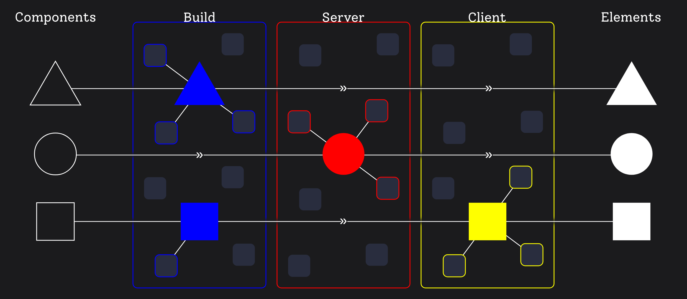

# Examples of How NextJS breaks React Fundamentals

In the front-end world, there is a war over performance.
RSC (React Server Components) currently implemented in NextJS App router are the official weapon, aimed at improving startup performance.
It seems in the battle, we forget about some fundamentals and, as a result, degraded DX (Developer Experience).
This article aims to provide examples of such <abbr title="Developer Experience">DX</abbr> in current NextJS API.
At the end I outline a better proposal.


<!-- truncate -->


I need to explicitly say, it is not my goal to blame, dishonor or offend React and NextJS maintainers. I respect everyone of them. Thank you for your work.
At the same time I want to clearly and constructively present what I think is wrong about the current API design.
So the discussion based on specific examples can emerge. 


This article loosely follows on from my previous article [Conceptual Model of React and RSC](/conceptula-model-of-react-and-rsc).
You will understand following text better if you read it. Which I recomend.


## DX > Performance

First of all let me defend the idea <abbr title="Developer Experience">DX</abbr> is more important than performance in terms of framework API design.

What I as app developer do when a change requirement arrives?
I throw some nasty components on a screen and start to craft. 
Add basic visual, connect real data, make it interactive, improve styles, add loading, error and empty UI, write tests, refactor component structure, solve bugs, optimize performance.


I do it usually in this order. I'm sure each of us prefer some different order. Some do <abbr title="Test Driven Development">TTD</abbr>,
some likes to start with pixel-perfect design with mockup data. It's ok.
However no devs I know care about performance at first.
Actually some believes it is a bad practice and should be avoided. 
Donald E. Knuth believes "Premature optimization is the root of all evil." or 
Michael A. Jackson stated "First rule of optimization: Don't do it.".

To be crystal clear: I'm not trying to convince you to not take performance-first approach.
I'm trying to convince you that many developers does not optimize at first. And it works well for us.
A general-purpose framework should, at least support, but better embrace this flow.
Fast delivery supported by great <abbr title="Developer Experience">DX</abbr> with best possible performance out-of-the-box.
Then provide easy optimization tooling like refactoring patterns, optimizer hinting, more aggressive caching config, etc.

Personally I'm ok if framework brings some syntax overhead due to performance optimization.
But it is unacceptable for me to hurt clear conceptual model and fundamental principles.


## Fundamentals

In the [previous article](/conceptual-model-of-react-and-rsc) I've described set of fundamental properties
I think any front-end framework should follow to provide good <abbr title="Developer Experience">DX</abbr>. Lets recap them quickly.

1. **Composable** - Or Homogenity. Ability to compose components into the full UI.<br/>
   Ability to place any component into any other component. Without change of its behaviour.

2. **Reusable** - Ability to define a name and reuse a component in a different place.
   Also, the ability to pass arbitrary configuration (possibly reactive state) to adjust its behavior (props).

3. **Colocated** - Name, render logic, necessary state connections, state derivation logic, styling, documentation, etc.
   Devs should be able to place all those dependencies inside a component.
   If not, devs jump back and forth in a codebase. Inconvenient.

4. **Encapsulated** - Ability to work on a component independently. Block all paths to affect the component from outside by default.
   Opt-in to break the barrier e.g. by exposing props. If not met, devs must mentally think about other code pieces.

5. **Reactive** - Component must react to connected state the dev chooses.
   Any component must be able to connect to any state. The same applies for derivation hooks.
   If some rules are required, it makes development jammed.

6. **Arbitrary** - The component's boundaries must obey the dev's needs.
   Nothing must force a component to split (or not to split).
   It destroys their purpose otherwise.

It seems to me NextJS implementation of <abbr title="React Server Components">RSC</abbr> breaks some of those fundamental properties
because of their performance-first design. Examples follow now.


## Sample Component

Imagine a requirement to create a page with a random quote about programming on each page refresh. Quotes are saved in a remote database.
How would you implement it in NextJS App router?

NextJS [data fetching docs](https://nextjs.org/docs/app/building-your-application/data-fetching/fetching-caching-and-revalidating)
suggests a simple async-await function within component render function.
Lets assume we have available `random(from, to)` lodash-like function for brievity.

```tsx
async fucntion ProgrammingQuotes() {
    // Here I want to connect to external database state of quotes 
    const quoutes = await fetch('/quotes')
    // Here I want to connect to a random number state
    const index = random(0, quotes.length)
    return <div>{quoutes[index]}</div>
}
```

Just place it somewhere on a page and we are done. Excellent <abbr title="Developer Experience">DX</abbr> so far.
It is a server-only component by default. Resulting in small bundle, no client-server round trips,
great <abbr title="First Contentful Paint">FCP</abbr> and <abbr title="Largest Contentful Paint">LCP</abbr>,
No <abbr title="Cumulative Layout Shift">CLS</abbr>. Awesome startup performance as promised.


## 1. Forced to Lift State up

Imagine a change requirement. Our UX department likes the component and wants it in an existing comments feed modal.
This modal is currenlty a client component. Somebody just wrote it as client because it needs some client-side state.

```tsx
'use client'
async fucntion FeedModal() {
    const [open, setOpen] = useState(false)
    return <>
      <Button toggle={setOpen}>Show comments</Button>
      <Modal opened={opened} >
         <Feed/>
         // error-next-line
         <ProgrammingQuotes/>
      </Modal>
    </>
}
```

...Ups. <mark class="error">"Error: Client component can't be async"</mark>. What happened? `'use client'` makes all of its descendants client components.
But our `ProgrammingQuotes` assumes it is a server component.
I see three options how to solve it with current NextJS abilities.

a. **Use client-side** data fetching solution like `tanstack-query`, `useSWC` or new `use` React API. Which means give up on RSC and its performance benefits. 

b. **Lift fetch up** into a first server ancestor. It is not enought to lift quotes fetching to `FeedModal`.
   We need to go higher and than drill the fetched quote data via props.
   Code **Colocation** property is torn apart.

c. **Refactor modules** so `ProgrammingQuotes` are passed as a children to `FeedModal`.
   However it forces me to compose components in a certain way. It does not obey my needs and therefore breaks **Arbitrary** boundary property.
   Furthermore I'm forced to expose a children prop. Which breaks **Encapsulation** property.

All of the options has negative impact on my work. Either on performance or worse project maintainability.


## 2. Forced to Split a Component

Imagine a change requirement. A quote is not random but should change every five seconds in order received from a database.
A way to access some counting state is with `setInterval` so lets use it.
I would adjust our component like this:

```tsx
async fucntion ProgrammingQuotes() {
    const quoutes = await fetch('/quotes')
    // highlight-next-line
    const index = useCounter(5000)
    return <div>{quoutes[index]}</div>
}

fucntion useCounter(delay) {
    // This hook is simplified for brevity
    // error-next-line
    const [count, setCount] = useState(0)
    // error-next-line
    useEffect(() => setInterval(() => setCount(count + 1), delay))
    return count
}
```

...Ups. <mark class="error">"Error: Server component can't use 'useState' and 'useEffect' hooks"</mark>.
Since server components can't react on time change (in other words can't reactively connect to time state) we need to use client component.
So maybe add `"use client"` to the top of the file?
...Ups. <mark class="error">"Error: Client component can't be async"</mark>. What do we do?
I see following options:

a. **Use client-side fetching**, but as stated above, we giving up on <abbr title="React Server Components">RSC</abbr> and their performance.

b. **Lift fetch up**, but as stated, it breaks code **Colocation**.

c. **Split component** into server parent and client child. Parent async with `fetch` and child with `useCounter`. However, we are actually forced to put them into separate file modules.
   So we end up with dislocated code. **Colocation** is broken anyway.

Again, I have no good choice. I have to sacrifice.
At this point, let me remind a talk about importance of a colocation
by Dan Abramov in his [Introduction of hooks (YouTube)](https://www.youtube.com/watch?v=dpw9EHDh2bM&t=2600s).


## 3. Forced to Prop drilling

Imagine a change requirement. We want to add quotes filtered by author. Author is placed in URL query param, so it can be shared and only Quotes of such author appears.
After previous example we end up with two components.

```tsx
async fucntion ProgrammingQuotesServer() {
    // Here I want to connect to URL query param state
    // error-next-line
    const author = useSearchParam('author');
    const quoutes = await fetch(`/quotes?author=${author}`)
    return <ProgrammingQuotesClient quotes={quotes}/>
}
```
```tsx
'use client'
async fucntion ProgrammingQuotesClient({ quotes }) {
    const index = useCounter(5000)
    return <div>{quoutes[index]}</div>
}
```

[NextJS docs](https://nextjs.org/docs/app/api-reference/functions/use-search-params#server-components)
suggests `useSearchParam` hook or `searchParams` props.

So lets try `useSearchParam` first.
...Ups. <mark class="error">"Error: Server component can't use 'useSearchParam' hook"</mark>
Ok. `searchParams` prop will help. ...Ups. This prop is accessible only in top-level page component.
I see following options:

a. **Use client-side fetching** means no RSC benefits.

b. **Drill prop** down from top-level page. In large apps with a deep component trees this is unmaintainable.

c. **Create context** for URL params and then access it with `useContext` from server component. Uf, a lot of work for such a basic use-case.
   But solved and I can resue this context for all other URL params and all components, right?


## 4. Forced to Give up on Server

Imagine a last change requirement. This little component should be moved to a footer component. Footer is in a page layout component tree.
...Ups. `searchParams` prop is inaccessible in layouts. What do I do? It's very frustrating, but it seems I need to refactor and convert it to client component to be able to use `useSearchParam`.
...Ups. <mark class="error">"Error: Client component can't be async"</mark>.
Am I just being forced to choose between server-side fetching or NextJS layouts feature?


## Summary

Those simple examples breaks most of the defined rules.
`ProgrammingQuotes` component can't be easily reused in modal or footer.
Its code is dislocated into several modules.
The author search query is inaccessible from the component itself.
I'm forced to expose children as a component prop
and create artificial Client and Server components.

I want to emphasize those examples are not some edge-case non-sense. Similar requirements are coming every day.
I'm 100 % sure at least one example happend to every developer who creates some non-trivial app in NextJS App router.
I trully believe Colocation, Encapsulation and Arbitrary composition are crucial properties for efficient development.
They are necessary for team cooperation and to maintain mid-large codebases.
Especially for long-term projects with many change requirements over the years where many developers read and manipulate the code and needs to quickly understand what is happening.
It's the reason I'm writing this. So we can design better framework APIs.

A lot of you argue I can use old client-side approach and then gradually move to the server.
Start with a full client-side app and if performance is needed, push client boundary down through a component tree.
You are smart.
I see three catches. 1. this is not recomended nor mentioned by the NextJS team. 2. <abbr title="In My Opinion">IMO</abbr> is too much work.
Both, writing but more importantly mental.
It is not just putting `'use client'` at the top of the module, but also modifying async code, using different methods to access URL, refactor component boundaries and more.
3. I believe there is a way to provide better out-of-the-box performance without compromising on DX.
And still keep the ability to achieve same performance as current NextJS with easier optimization path.


## A better approach

In NextJS implementation of RSC we define if a component is server or client at module level.
If compiler sees `'use client'` a code is bundled and shiped to client. Stays server-only otherwise.
In other words we are choosing where a component is rendered resp. its runtime environment.
This component runtime then limits its capabilities. E.g. using of async fetching or client state.

Last example with layouts limits components capabilities based on a module too.
If compiler sees a file named `layout.tsx`, its components are considered "more static".
Some more dynamic state like search params can't be used.

I believe <mark>component capabilities should never be limited by a module level configuration</mark>.
Any component must be capable to use any feature. <mark>Where rendered and when re-rendered should be deduces automatically</mark>
by features used within component.

Both runtime environment and re-rendering frequency are unrelated to my business goals. 
Ideally it is an implementation detail and a framework should shield me from it.
Best performant strategy should be choosen by framework automatically.
It is the same how re-rendering works on client nowdays. Developer use some state within component and it re-renders when the state changes.
No manual tweaking of shouldComponentUpdate. Same applies for signals.

Paradoxically NextJS inspired me with this idea.
It chooses between build and request-time rendering based on [Dynamic functions](https://nextjs.org/docs/app/building-your-application/rendering/server-components#dynamic-functions)
used within component.
For [some reason](https://nextjs.org/docs/app/api-reference/file-conventions/layout#layouts-do-not-receive-searchparams) they limit this deduction in layouts.
I believe this automatic deduction concept should be used more broadly.


<p style={{ textAlign: `center` }}>*Components go through runtimes and if some state is needed, they re-render. Pass environment otherwise.*</p>

At the end, let's think together about this algorithm of automatic runtime environment deduction.
First of all, what environments we have available resp. where the component could be rendered?
For sure on a client in a browser. Also on a server. We should distinguish between static rendering during build and dynamic renderign during server request.
There are more flavours, like edge runtime or <abbr title="Deferred Static Generation">DSG</abbr>, but lets stick with just those three for now.
Lets sort them by performance. For most cases it is like this: Build, Server, Client.
I want to choose the most performant automatically if nothing forces me otherwise.

What forces a component to use less performant runtime? It is when a component needs some more dynamic or interactive features resp. connects to some kind of dynamic or interactive state.
When a component connects to `searchParam`, `cookie` or `headers` those states are not known during build-time and it must be rendered during server request.
This is what NextJS does with dynamic functions I mentioned above.
Similarly when a component connects to `useState`, `setInterval` or `onMouseEnter` it must be rendered on client, because those states are not accessible on the server.


I hope your head is screaming now "But Ondrej, it would not work! Bundling is a compile-time feature!".
If so I've done a good job explaining my thoughts. Congratulation. You understand the concept correctly.
There are many questions to be answered.
What if a callback fn is passed to a component as a prop?
Are there situations a component is rendered in multiple runtimes?
Many details are unresolved. But lets stop here.

I plan to write a following article where I dive into an API of a new fictional framework and also touch some implementation possibilities.
Until then I invite you to think about its DX benefits and how you would implement it. Try to think how and not why cant't.
And let me know what do you think.

Thanks for reading.
