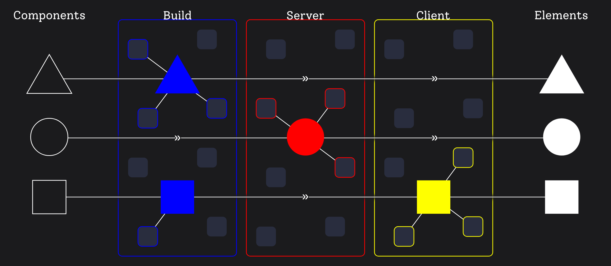

# How Next.js breaks React Fundamentals (Examples)

In the front-end world, there's an ongoing war over performance.
RSC (React Server Components), currently implemented in the Next.js App router, serve as the official weapon aimed at improving startup performance.
However, it seems that in the midst of this battle, we've forgotten about some fundamentals, resulting in a degraded DX (Developer Experience).
This article aims to provide examples of such DX issues in the current Next.js API.
Towards the end, I outline a better proposal.

{/* truncate */}

I want to make it explicitly clear that it's not my intention to blame, dishonor, or offend React and Next.js maintainers.
I have respect for each one of them and appreciate their work. Thank you for your contributions.
However, at the same time, I want to present what I believe is wrong about the current API design in a clear and constructive manner.
This way, we can foster a discussion based on specific examples.

This article loosely follows on from my previous piece, [Conceptual Model of React and RSC](/conceptual-model-of-react-and-rsc).
Reading it beforehand will provide better context for the following text, which I highly recommend.


## DX > Performance

First of all, let me defend the idea that <abbr title="Developer Experience">DX</abbr> is more important than performance in terms of framework API design.

What do I, as an app developer, do when a change requirement arrives?
I throw some nasty components on a screen and start crafting.
I add basic visuals, connect real data, make it interactive, improve styles, add loading, error, and empty UI, write tests, refactor component structure, solve bugs, optimize performance.

I usually do it in this order. I'm sure each of us prefers a different order. Some do <abbr title="Test Driven Development">TTD</abbr>,
some like to start with a pixel-perfect design with mockup data. It's okay.
However, no devs I know care about performance at first.
Actually, some believe it is bad practice and should be avoided.
Donald E. Knuth believes "Premature optimization is the root of all evil." or
Michael A. Jackson stated, "First rule of optimization: Don't do it."

To be crystal clear: I'm not trying to convince you to not take a performance-first approach.
I'm trying to convince you that many developers do not optimize at first. And it works well for us.
A general-purpose framework should, at least, support, but better embrace this flow.
Fast delivery supported by great <abbr title="Developer Experience">DX</abbr> with the best possible performance out-of-the-box.
Then provide easy optimization tooling like refactoring patterns, optimizer hinting, more aggressive caching config, etc.

Personally, I'm okay if a framework brings some syntax overhead due to performance optimization.
But it is unacceptable for me to hurt the clear conceptual model and fundamental principles.


## Fundamentals

In the [previous article](/conceptual-model-of-react-and-rsc/), I described a set of fundamental properties I believe any front-end framework should follow to provide a good <abbr title="Developer Experience">DX</abbr>. Let's quickly recap them.


1. **Composable** - Or Homogeneity. The ability to compose components into the full UI.
   Ability to place any component into any other component without changing its behavior.

2. **Reusable** - The ability to define a name and reuse a component in a different place. Also, it involves passing arbitrary configuration (possibly reactive state) to adjust its behavior (props).

3. **Colocated** - The ability to place all dependencies inside a component: name, render logic, necessary state connections, state derivation logic, styling, documentation, etc. If this is not met, developers have to jump back and forth in a codebase.

4. **Encapsulated** - The ability to work on a component independently. All paths to affect the component from outside should be blocked by default. Breaking the barrier, for example, by exposing props, should be an opt-in feature. If this is not met, developers must mentally consider other code pieces.

5. **Reactive** - A component must react to the connected state chosen by the developer. Any component must be able to connect to any state, and the same applies to derivation hooks. If certain rules are required, development becomes jammed.

6. **Arbitrary** - The component's boundaries must obey the developer's needs. Nothing must force a component to split or not to split, as it would destroy its purpose.

It seems to me that Next's implementation of <abbr title="React Server Components">RSC</abbr> breaks some of these fundamental properties due to their performance-first design. Examples follow now.


## Sample Component

Imagine a requirement to create a page with a random quote about programming on each page refresh. Quotes are saved in a remote database.
How would you implement it in the Next.js App router?

Next.js [data fetching docs](https://nextjs.org/docs/app/building-your-application/data-fetching/fetching-caching-and-revalidating)
suggest a simple async-await function within the component render function.
Let's assume we have the `random(from, to)` lodash-like function for brevity.

```tsx
async function ProgrammingQuotes() {
    // Here I want to connect to the external database state of quotes 
    const quotes = await fetch('/quotes')
    // Here I want to connect to a random number state
    const index = random(0, quotes.length)
    return <div>{quotes[index]}</div>
}
```

Just place it somewhere on a page and we're done. Excellent <abbr title="Developer Experience">DX</abbr> so far.
It's a server-only component by default. Resulting in a small bundle, no client-server round trips,
great <abbr title="First Contentful Paint">FCP</abbr> and <abbr title="Largest Contentful Paint">LCP</abbr>,
No <abbr title="Cumulative Layout Shift">CLS</abbr>. Awesome startup performance as promised.


## 1. Forced to Lift State up

Imagine a change requirement. Our UX department likes the component and wants it in an existing comments feed modal.
This modal is currently a client component. Somebody just wrote it as client because it needs some client-side state.

```tsx
'use client'
async function FeedModal() {
    const [open, setOpen] = useState(false)
    return <>
      <Button toggle={setOpen}>Show comments</Button>
      <Modal opened={opened} >
         <Feed/>
         // error-next-line
         <ProgrammingQuotes/>
      </Modal>
    </>
}
```

...Oops. <mark class="error">"Error: Client component can't be async"</mark>. What happened? `'use client'` makes all of its descendants client components.
But our `ProgrammingQuotes` assumes it is a server component.
I see three options for how to solve it with current Next.js abilities.

a. **Use client-side** data fetching solutions like `tanstack-query`, `useSWC`, or the new `use` React API. This means giving up on RSC and its performance benefits. 

b. **Lift fetch up** into a first server ancestor. It is not enough to lift quotes fetching to `FeedModal`.
   We need to go higher and then drill the fetched quote data via props.
   The code **Colocation** property is torn apart.

c. **Refactor modules** so `ProgrammingQuotes` is passed as children to `FeedModal`.
   However, it forces me to compose components in a certain way. It does not obey my needs and therefore breaks the **Arbitrary** boundary property.
   Furthermore, I'm forced to expose a children prop. Which breaks the **Encapsulation** property.

All of the options have a negative impact on my work. Either on performance or worse project maintainability.


## 2. Forced to Split a Component

Imagine a change requirement. A quote is not random but should change every five seconds in the order received from a database.
A way to access some counting state is with `setInterval` so let's use it.
I would adjust our component like this:

```tsx
async function ProgrammingQuotes() {
    const quotes = await fetch('/quotes')
    // highlight-next-line
    const index = useCounter(5000)
    return <div>{quotes[index]}</div>
}

function useCounter(delay) {
    // This hook is simplified for brevity
    // error-next-line
    const [count, setCount] = useState(0)
    // error-next-line
    useEffect(() => setInterval(() => setCount(count + 1), delay))
    return count
}
```

...Oops. <mark class="error">"Error: Server component can't use 'useState' and 'useEffect' hooks"</mark>.
Since server components can't react to time changes (in other words, they can't reactively connect to time state), we need to use a client component.
So maybe add `"use client"` to the top of the file?
...Oops. <mark class="error">"Error: Client component can't be async"</mark>. What do we do?
I see the following options:

a. **Use client-side fetching**, but as stated above, we give up on <abbr title="React Server Components">RSC</abbr> and their performance.

b. **Lift fetch up**, but as stated, it breaks the code **Colocation**.

c. **Split the component** into a server parent and a client child. The parent is async with `fetch`, and the child uses `useCounter`. However, we are actually forced to put them into separate file modules.
   So we end up with dislocated code. **Colocation** is broken anyway.

Again, I have no good choice. I have to sacrifice.
At this point, let me remind you of a talk about the importance of colocation
by Dan Abramov in his [Introduction of hooks (YouTube)](https://www.youtube.com/watch?v=dpw9EHDh2bM&t=2600s).


## 3. Forced to Prop Drilling

Imagine a change requirement. We want to add quotes filtered by author. The author is placed in the URL query param, so it can be shared, and only quotes of such author appear.
After the previous example, we end up with two components.

```tsx
async function ProgrammingQuotesServer() {
    // Here I want to connect to the URL query param state
    // error-next-line
    const author = useSearchParam('author');
    const quotes = await fetch(`/quotes?author=${author}`)
    return <ProgrammingQuotesClient quotes={quotes}/>
}
```
```tsx
'use client'
async function ProgrammingQuotesClient({ quotes }) {
    const index = useCounter(5000)
    return <div>{quotes[index]}</div>
}
```

[Next.js docs](https://nextjs.org/docs/app/api-reference/functions/use-search-params#server-components)
suggest `useSearchParam` hook or `searchParams` props.

So let's try `useSearchParam` first.
...Oops. <mark class="error">"Error: Server component can't use 'useSearchParam' hook"</mark>
Okay. `searchParams` prop will help. ...Oops. This prop is accessible only in the top-level page component.
I see the following options:

a. **Use client-side fetching** means no RSC benefits.

b. **Drill props** down from the top-level page. In large apps with a deep component tree, this is unmaintainable.

c. **Create context** for URL params and then access it with `useContext` from the server component. Uf, a lot of work for such a basic use-case.
   But it's solved, and I can reuse this context for all other URL params and all components, right?


## 4. Forced to Give up on Server

Imagine a last change requirement. This little component should be moved to a footer component. The footer is in a page layout component tree.
...Oops. `searchParams` prop is inaccessible in layouts. What do I do? It's very frustrating, but it seems I need to refactor and convert it to a client component to be able to use `useSearchParam`.
...Oops. <mark class="error">"Error: Client component can't be async"</mark>.
Am I just being forced to choose between server-side fetching or Next.js layouts feature?


## Summary

Those simple examples break most of the defined rules.
The `ProgrammingQuotes` component can't be easily reused in a modal or footer.
Its code is dislocated into several modules.
The author search query is inaccessible from the component itself.
I'm forced to expose children as a component prop
and create artificial Client and Server components.

I want to emphasize that these examples are not some edge-case nonsense. Similar requirements come up every day.
I'm 100% sure that at least one example has happened to every developer who creates some non-trivial app in the Next.js App router.
I truly believe Colocation, Encapsulation, and Arbitrary composition are crucial properties for efficient development.
They are necessary for team cooperation and maintaining mid-large codebases.
Especially for long-term projects with many change requirements over the years where many developers read and manipulate the code and need to quickly understand what is happening.
That's the reason I'm writing this. So we can design better framework APIs.

Many of you argue that I can use the old client-side approach and then gradually move to the server.
Start with a full client-side app and if performance is needed, push the client boundary down through a component tree.
You are smart.
I see three catches. 1. this is not recommended nor mentioned by the Next.js team. 2. <abbr title="In My Opinion">IMO</abbr> is too much work.
Both, writing but more importantly mental.
It is not just putting `'use client'` at the top of the module, but also modifying async code, using different methods to access URLs, refactor component boundaries and more.
3. I believe there is a way to provide better out-of-the-box performance without compromising on DX.
And still keep the ability to achieve the same performance as current Next.js with an easier optimization path.


## A Better Approach

In Next.js implementation of RSC, we define if a component is server or client at the module level.
If the compiler sees `'use client'`, the code is bundled and shipped to the client. It stays server-only otherwise.
In other words, we are choosing where a component is rendered, respectively its runtime environment.
This component runtime then limits its capabilities, e.g., using async fetching or client state.

The last example with layouts limits component capabilities based on a module too.
If the compiler sees a file named `layout.tsx`, its components are considered "more static".
Some more dynamic state like search params can't be used.

I believe <mark>component capabilities should never be limited by a module-level configuration</mark>.
Any component must be capable of using any feature. <mark>Where rendered and when re-rendered should be deduced automatically</mark>
by features used within the component.

Both runtime environment and re-rendering frequency are unrelated to my business goals. 
Ideally, it is an implementation detail and a framework should shield me from it.
The best-performing strategy should be chosen by the framework automatically.
It is the same as how re-rendering works on the client nowadays. Developers use some state within a component, and it re-renders when the state changes.
No manual tweaking of shouldComponentUpdate. The same applies to signals.

Paradoxically, Next.js inspired me with this idea.
It chooses between build and request-time rendering based on [Dynamic functions](https://nextjs.org/docs/app/building-your-application/rendering/server-components#dynamic-functions)
used within the component.
For [some reason](https://nextjs.org/docs/app/api-reference/file-conventions/layout#layouts-do-not-receive-searchparams), they limit this deduction in layouts.
I believe this automatic deduction concept should be used more broadly.


<p style={{ textAlign: `center` }}>*Components go through runtimes and if some state is needed, they re-render. Pass the runtime otherwise.*</p>

In the end, let's think together about this algorithm of automatic runtime environment deduction.
First of all, what environments do we have available, respectively where could the component be rendered?
For sure on a client in a browser. Also on a server. We should distinguish between static rendering during build and dynamic rendering during server request.
There are more flavors, like edge runtime or <abbr title="Deferred Static Generation">DSG</abbr>, but let's stick with just those three for now.
Let's sort them by performance. For most cases, it is like this: Build, Server, Client.
I want to choose the most performant automatically if nothing forces me otherwise.

What forces a component to use a less performant runtime? It is when a component needs some more dynamic or interactive features, respectively connects to some kind of dynamic or interactive state.
When a component connects to `searchParam`, `cookie`, or `headers`, those states are not known during build-time and it must be rendered during server request.
This is what Next.js does with dynamic functions I mentioned above.
Similarly, when a component connects to `useState`, `setInterval`, or `onMouseEnter`, it must be rendered on the client because those states are not accessible on the server.

I hope your head is screaming now "But Ondrej, it would not work! Bundling is a compile-time feature!".
If so, I've done a good job explaining my thoughts. Congratulations. You understand the concept correctly.
There are many questions to be answered.
What if a callback function is passed to a component as a prop?
Are there situations a component is rendered in multiple runtimes?
Many details are unresolved. But let's stop here.

I plan to write a following article where I dive into the API of a new fictional framework and also touch some implementation possibilities.
Until then, I invite you to think about its DX benefits and how you would implement it. Try to think how and not why can't.
And let me know what you think.

Thanks for reading.


import Discuss from '@site/components/Discuss'

<Discuss
    twitter="https://x.com/search?q=https%3A%2F%2Fondrejvelisek.github.io%2Fhow-nextjs-breaks-react-fundamentals%2F"
    reddit="https://www.reddit.com/r/nextjs/comments/1bipvwe/how_nextjs_breaks_react_fundamentals_with_examples/"
    dev="https://dev.to/ondrejvelisek/how-nextjs-breaks-react-fundamentals-with-examples-2lof"
    />