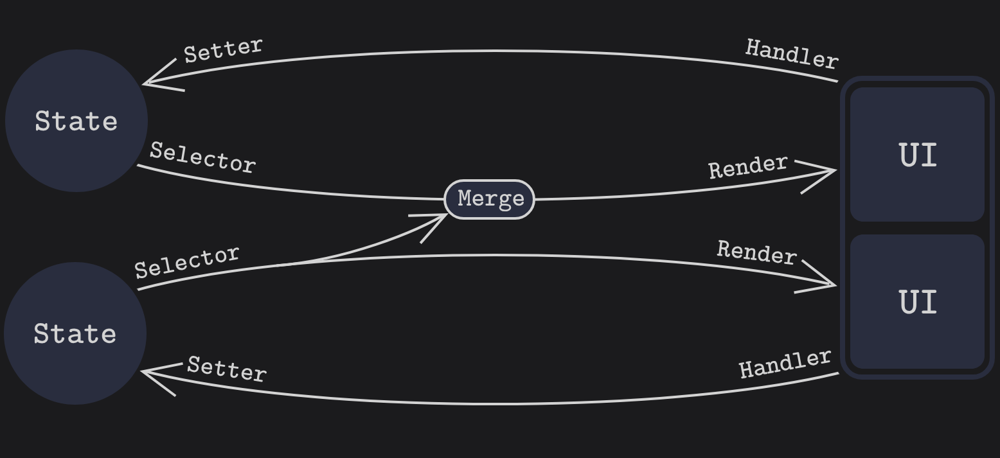

import { Pro, Con } from '@site/components/ProsCons'


# Avoid the State Synchronization Trap

This post is about a bad code pattern I see quite often.
It’s about state management, particularly state synchronization. Often it is a source of bugs, glitches, and performance problems.

Usually it is solvable by adjusting the state shape.
More precisely, splitting the state into pieces and merging the pieces later in selectors, render functions, or custom hooks.
An interesting fact is that one of those states is empty or undefined, but the UI renders desired items anyway. It might seem unintuitive, but bear with me.

{/* truncate */}

During the Redux era, we discussed state shape a lot. It was called state normalization.
Nowadays, it is rarely touched, even though it is still important.
To make my thoughts easier to understand, I sometimes use Redux terminology, like selectors and actions, throughout this article.

I’ll present the problem using an example of an orders table. The example is quite long, but I believe it is useful.
It is based on a real-world application. I simplify, but in principle, I saw it in a real codebase.

One last note before we start: I talk about React but the ideas are applicable to any modern FE framework (regardless if signal-based or not).


&nbsp;

## Example

Let’s illustrate state synchronization through an evolving example, starting simply and becoming increasingly complex over several hypothetical years.


&nbsp;

### 2025: List of Orders

import ExampleOrdersList from './Example/Example1OrdersList'

<ExampleOrdersList/>

```tsx
function OrdersList() {
    const orders = useOrders();
    return <Table data={orders} />;
}
```

It’s the year 2025, and you work on this cool project called Outstanding Overview of Opulus Orders (OOoOO).
You work on a page with a data table: a list of orders.
Component `OrdersList` uses hook `useOrders`, which internally uses TanStack Query to fetch orders from a backend API.
With the given orders data, you use a UI component `Table`, which renders it. Easy peasy.


&nbsp;

### 2026: Custom Columns

import Example2Columns from './Example/Example2Columns'

<Example2Columns/>

```tsx
function OrdersList() {
  const [columns] = useContext(ColumnsCtx)
  const orders = useOrders(columns)
  return <Table data={orders} />
}
```

```tsx
const initColumns = [
  { attribute: 'date' },
  { attribute: 'order' },
  { attribute: 'customer' },
  { attribute: 'amount' },
]

function ColumnsProvider() {
  const [columns, setColumns] = useState(initColumns)
  ...
}
```

Fast forward. It’s the year 2026, and your customer’s business has grown internationally, introducing new requirements.
They collect additional attributes about Opulus orders, like currency and country.
They want to allow users to show more columns in the table. So you add a <code>⚙</code> button beside the table header.
When the user clicks it, a dropdown with available columns appears. The user can select and deselect which columns are visible.

Since visible columns might change, they can’t be a constant and you need to store them in some kind of updatable state.
They need to be accessed from multiple components (like `OrdersList` and the <code>⚙</code> button dropdown).
To avoid prop drilling, we store columns in some higher-level state.
Here I use React Context `ColumnsCtx`, but feel free to imagine Zustand, Jotai, Redux, or URL. It does not matter for our purposes.
You initialize the state with a constant containing the default columns.
(If URL surprised you, you might want to read my previous article [Conceptual Model of React and RSC](/conceptual-model-of-react-and-rsc)).


&nbsp;

### 2027: Filters

import Example3Filters from './Example/Example3Filters'

<Example3Filters/>

```tsx
function Filters() {
  const [filters] = useContext(FiltersCtx)
  return filters.map(filter => (
    <Filter filter={filter} />
  ))
}
```

```tsx
function OrdersList() {
  const [columns] = useContext(ColumnsCtx)
  const [filters] = useContext(FiltersCtx)
  const orders = useOrders(columns, filters)
  return <Table data={orders} />
}
```

```tsx
type Filters = Array<{
  attribute: string,
  operator?: '='|'>'|'<',
  values?: Array<string|number>
}>

function FiltersProvider() {
  const [filters, setFilters] = useState()
  ...
}
```

Fast forward to 2027. The customer’s business continues to grow. There are many Opulus orders now.
Therefore, the customer wants you to implement filtering rows by values.
The user should be able to filter only visible columns.
Not a trivial feature request, but let’s do it.

You add a new `Filters` component.
Similarly to columns, the visible filters might change. They can’t be a constant and you need to store them in a state.
They are required by multiple components. So to avoid prop drilling, you store them in a new Context `FiltersCtx`.

Filtering works like this.
The User selects some filter value e.g. Customer "Ondrej".
The state setter is called from `Filter` component.
The `FiltersCtx` state value is updated.
The reactivity system rerenders the `OrdersList` component.
`useOrders` hook receives updated state and refetches data with new `filters`.

You can try it by yourself with interactive working example above.


&nbsp;

## State Initialization

Seems nice. You try to run the code, and… it does not show any filters. Can you guess why?
(Note I’ve already fixed the example above, to ilustrate what we are trying to build)

It is because the filters context is empty. We need to initialize the filter state.
`useState` has an initialization property. We can use it.

import Example4Initialized from './Example/Example4Initialized'

<Example4Initialized/>

```tsx
const initColumns = [
  { attribute: 'date' },
  { attribute: 'order' },
  { attribute: 'customer' },
  { attribute: 'amount' },
]

function FiltersProvider() {
  const [filters, setFilters] = useState(initColumns)
  ...
}
```

It shows the filters now. But…

When you add or remove columns, the filters are not updated.
The desired behavior is: when the user adds a new column, the filter for this column is also added.
In other words, synchronize columns and filters states.
Maybe this will help?

```tsx
function FiltersProvider() {
  const [columns] = useContext(ColumnsCtx)
  const [...] = useState(columns)
  ...
}
```

Nope. Filters are still static because the `useState` argument is used at the first render only.
We need to update the filters state somehow.


&nbsp;

## State Synchronization

### 1. Direct Setters Approach

import Attempt3Setter from './Example/Attempt3Setter'

<Attempt3Setter/>

```tsx
const onAddColumnClick = (attribute) => {
    addColumn(attribute)
    addFilter(attribute)
}
```

This works. Finally… Oops. You forgot to synchronize the remove column handler.
Fast forward. 2028. You are implementing reset columns to default. Oops. Forgot to reset filters as well.
Fast forward. 2029. Implementing column presets. Oops. Forgot to update filters as well.
Fast forward. 2030. Oops…

You got the idea. This way you need to keep in mind, every time some functionality which updates columns is added, you need to update filters as well.
This is unmaintainable and error-prone.

<ul className="list-none pl-2">
  <Pro>Simple</Pro>
</ul>
<ul className="list-none pl-2">
  <Con>Unmaintainable in a long run</Con>
</ul>


&nbsp;

### 2. Gate Setter Approach

```tsx
function ColumnsProvider() {
  const [columns, setColumnsInner] = useState(initColumns)
  const { setFilters } = useContext(FiltersContext)
  const setColumns = (columns) => {
    setColumnsInner(columns)
    setFilters(columns)
  }
  // use setColumns instead of setColumnsInner
  ...
}
```

So naturally you centralized state update logic and moved the setter closer to the state, creating some kind of gate where all updates must come through.
In `ColumnsProvider`, you implemented a `setColumns` wrapper function.

It works… Oops. Now, when you add a new column, all filters are reset.
So you need to write some merge function which modifies only filters that changed.

```tsx
const setColumns = (columns) => {
    setColumnsInner(columns)
    setFilters(prevFilters =>
        mergeFilters(prevFilters, columns)
    );
}
```

It is definitely a better approach, but if you’re like me, you feel it is still fragile in the long run.
After some years and several new colleagues, somebody will create code that calls `setColumnsInner` directly without your gate.

I also find it unexpected and confusing that `ColumnsProvider` depends on `FiltersContext`, but I’ll let you decide if that’s your view too.
I would expect it the other way around.

You might also end up with cyclic dependency because, if you remember the initialization logic above, you know `FiltersProvider` depends on `ColumnsContext`.
So we need to use constant for initializing filters instead, which creates a needs to keep the initial value in sync too.

<ul className="list-none pl-2">
  <Pro>Better maintainability</Pro>
</ul>
<ul className="list-none pl-2">
  <Con>Need for merging function</Con>
  <Con>Reverted dependency</Con>
  <Con>Cyclic dependency</Con>
</ul>

Is there a better option?


&nbsp;

### 3. Effect Approach

import Attempt6Effect from './Example/Attempt6Effect'

<Attempt6Effect/>

```tsx
const [columns] = useContext(ColumnsCtx)
const [setFilters] = useContext(FiltersCtx)
useEffect(() => {
    setFilters(prevFilters =>
        mergeFilters(prevFilters, columns)
    );
});
```

You may think of `useEffect`. It can react to any change to columns state.
Oops. Again, we need to use the `mergeFilters` function to avoid resetting all filters.

But there is a bigger problem. `useEffect` is not synchronous, and it does not run in the same render cycle.
So when you add a new column, the filters are not updated immediately.
There is a brief timeframe where your filters are not in sync with columns.

It can be a source of bugs and glitches.
The UI jumps back and forth. It is visually disturbing and can break animations.

But more importantly, it causes a double refetch, leading to performance issues, unnecessary server load, and increased costs.
You can see it by yourself in the interactive example above. Try to change visible columns and watch fired requests counter.

<ul className="list-none pl-2">
  <Pro>Good maintainability</Pro>
  <Pro>No weird dependencies</Pro>
</ul>
<ul className="list-none pl-2">
  <Con>Asynchronous update</Con>
  <Con>UI glitches</Con>
  <Con>Doubled fetching</Con>
  <Con>Need for merging function</Con>
</ul>

Do not use `useEffect` for synchronizing states.


&nbsp;

### 4. Selector Approach

import Attempt7Selector from './Example/Attempt7Selector'

<Attempt7Selector/>

```tsx
function useFilters() {
  const [attributes] = useContext(AttributesCtx)
  const [filters] = useContext(FiltersCtx)
  return attributes.map((attribute) => {
    const filter = filters[attribute]
    return { attribute, ...filter }
  })
}
```

```tsx
type Filters = {
    [attribute: string]: {
        operator?: '='|'>'|'<',
        value?: string|number
    }   
}
```

What you encountered is a problem with state synchronization caused by duplicate state.
Filters and columns are different entities, but part of their state is duplicated and can be shared.
It’s about visible attributes. So we extract the visible attributes from both states and derive visible columns and filters from them.
Let’s step into a time machine and go back to 2027, where we were shaping filters state.

We want to change the semantics of the filters state. It will not hold which filters are visible but just which attributes are filtered.
We adjust the shape of the filters and make it a dictionary.
The `useFilters` hook will merge two states: visible attributes and modified filters.
The benefit is that we do not have to initialize the state at all.
Since columns don’t contain any additional state beyond attributes, we can use attributes directly in the same manner as columns before (this is not always the case, but let’s keep this example simple).



This way, filters will always be the same as columns.
Even if the filters state is empty, there is no need for initialization.
The change is synchronous. No glitches. No useless refetches.
Columns are independent of Filters.
The column state can be updated in any way, and the reactivity system will take care of rerunning this derivation logic.

You might argue someone can forget to use this hook and access the filters state directly.
You are right.
So what’s the advantage compared to the `setColumns` wrapper function?
But <abbr title="In My Opinion">IMO</abbr>, it is less likely to happen because one will experience an empty state at first sight.

Also, this derivation logic (selector) is easier to maintain than a setter (action) because it is reactive.
We just focus on control logic, not when it should be called.
The reactive system takes care of it.

It is fair to say that there is a hidden user experience difference.
When the attribute is filtered, then removed and added again, it holds the previous filter values.
Therefore, orders are filtered after the column is added back.
You can try it by yourself in the interactive example above.

Sometimes this behavior is even desired, but in this situation it is unintuitive, and I see it as a disadvantage here.
It is fixable by combining this selector approach with the previously mentioned gate setter approach.
Simply clear the selected filter whenever a column is removed.
But I will keep this article short and will not go into detail with this.
I see this as an edge-case, and I believe mentioned benefits outweigh this disadvantage.
But feel free to make your own opinion here.

<ul className="list-none pl-2">
  <Pro>Good maintainability</Pro>
  <Pro>No weird dependencies</Pro>
  <Pro>Synchronous update</Pro>
  <Pro>No UI glitches</Pro>
  <Pro>Single fetch</Pro>
</ul>
<ul className="list-none pl-2">
  <Con>Overly persistent state</Con>
</ul>


&nbsp;

## Conclusion

In 2027, we made a quite dangerous assumption: that columns and filters must be in sync.
It is an invariant of your state shape, which TypeScript is not able to check. Therefore, you need to handle it manually.
This was just one example inspired by a real-world problem. But I frequently see developers using effects and setters to synchronize states.
Selectors generally provide more maintainable solutions, are synchronous, and ensure immediate, predictable updates.

<abbr title="In My Opinion">IMO</abbr>, these state invariants represent a bad code smell.
They frequently cause bugs, glitches, and performance issues.
Try to develop a nose for these invariants and pay attention when someone introduces one into your app.

I know the world out there is wild. Perhaps your junior colleague has already created a shape like this, 
and it’s deeply baked into your app, leaving no time to refactor the entire codebase.
In such a case, I would recommend going with the gate setter solution.
Definitely avoid `useEffect` if possible.
Additionally, consider implementing a function that checks invariants that must always hold true for your state.
You can run this function within your derivation logic (selectors) to alert you immediately if an invariant breaks.

I hope I’ve given you some material to think about. As always, if you disagree with me, I encourage you to get in touch. In any case…

Thanks for reading.


 

&nbsp;